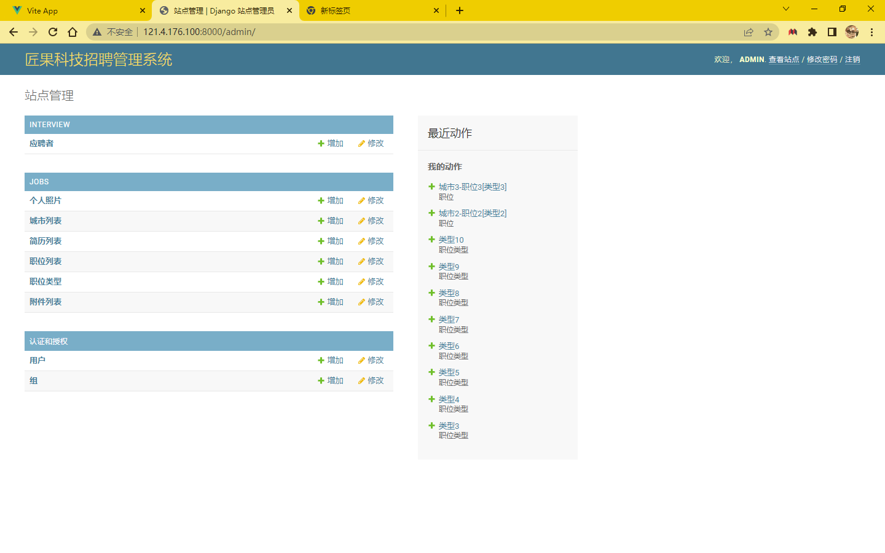
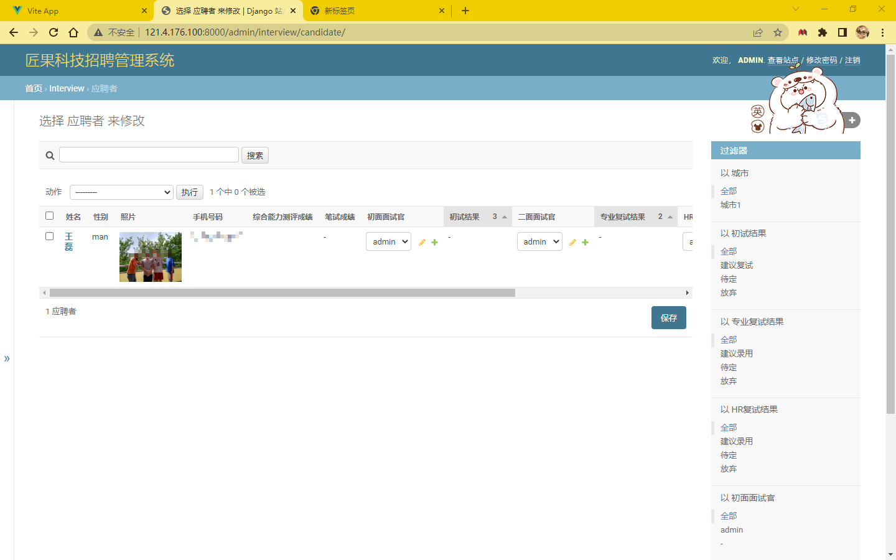
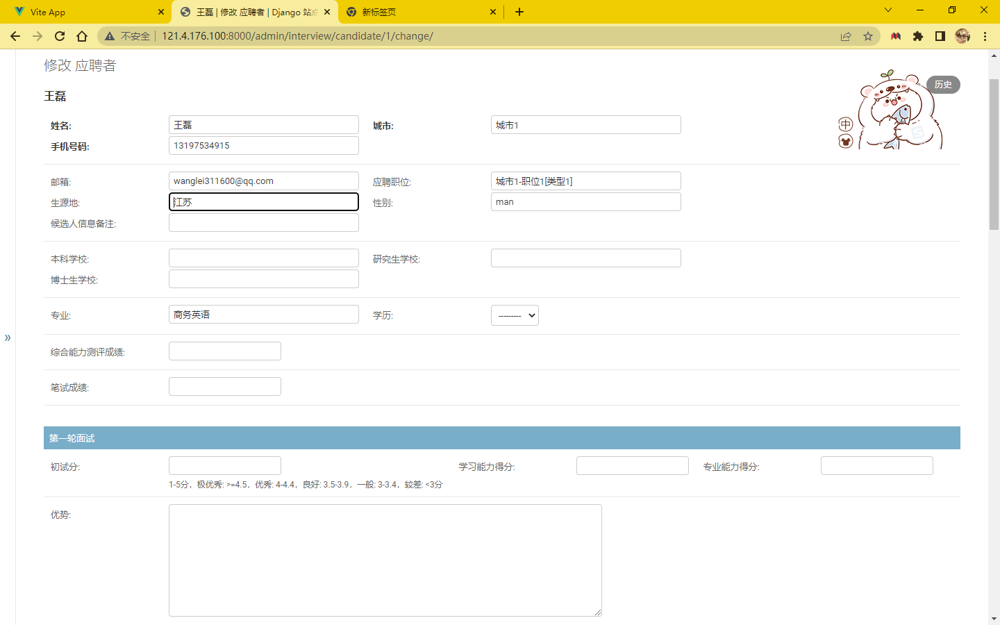
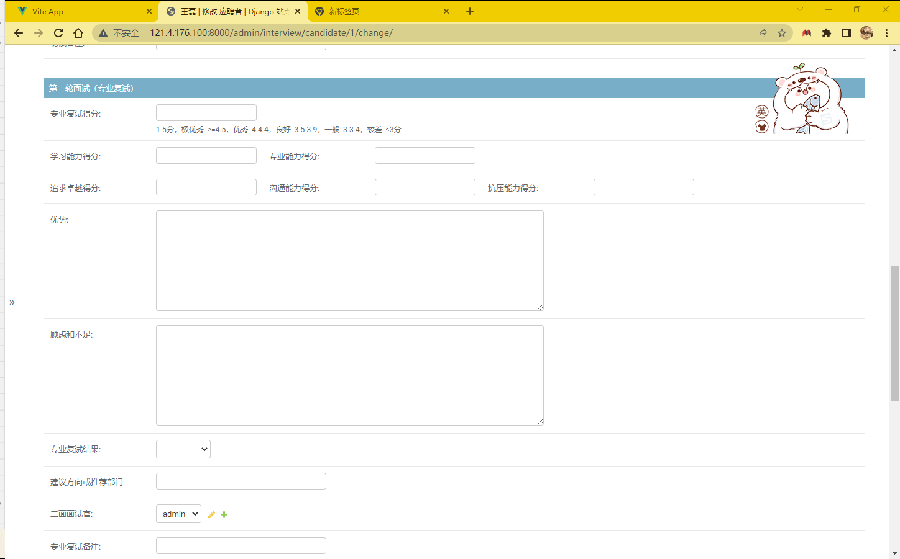
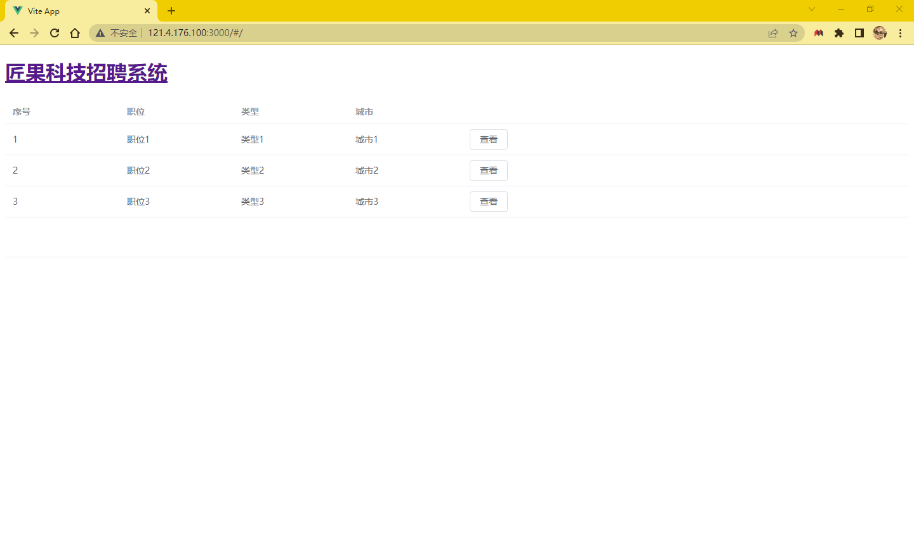
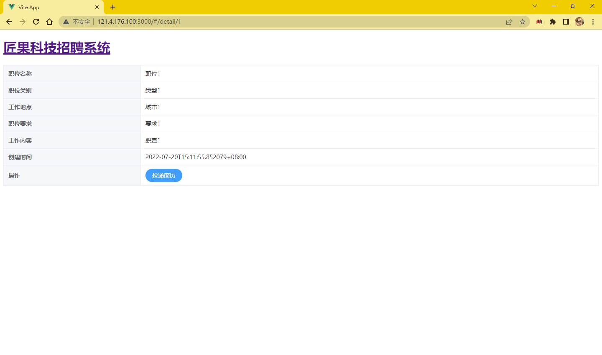

# 匠果招聘：项目说明
用做创业公司职位发布，简历投递，招聘管理的开源项目，基于高效的Django & Python开发。

软件架构：Django+Vue+Sentry+Celery+Webhook

展示地址：

对外招聘页面：http://121.4.176.100:3000 

招聘后台：http://121.4.176.100:8000

仓库地址：https://github.com/pokerLL/RecruitmentLL

这是一个使用 Python Django 两天就可以开发出来的项目，经过逐步完善可以满足不同企业的招聘管理需求。 可集成企业域账号、发布职位、候选人可以投递简历、可以在面试过程中评估简历。 可以导入，导出候选人数据。

项目前后端分离：

前端分为对外网站和招聘后台，对外网站使用Vue实现职位的查看以及简历的投递，招聘后台（面试官，HR等使用）基于Django Admin后台进行开发，实现人员、面试信息、简历信息等的管理和权限控制（各种角色只能浏览和修改自己所属的部分）。

后端基于Django+DRF进行实现API的开发。

项目集成Webhook钉钉信息发送，自动在钉钉上发送信息通知相关人员，项目利用Sentry进行bug和日志的监控以及利用Celery进行异步任务的执行，Nginx进行前端项目的部署

# 项目效果
招聘后台 - 首页 

招聘后台 - 候选人列表 

招聘系统后台 - 评估候选人 

对外招聘网站 - 职位列表 

对外招聘网站 - 职位详情

对外招聘网站 - 申请职位

